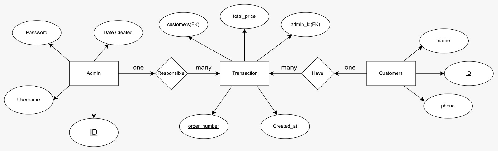
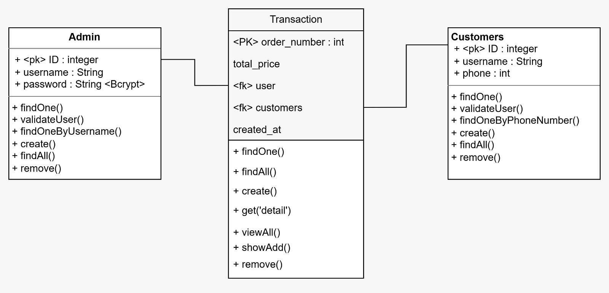
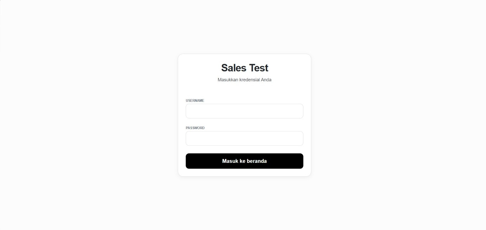
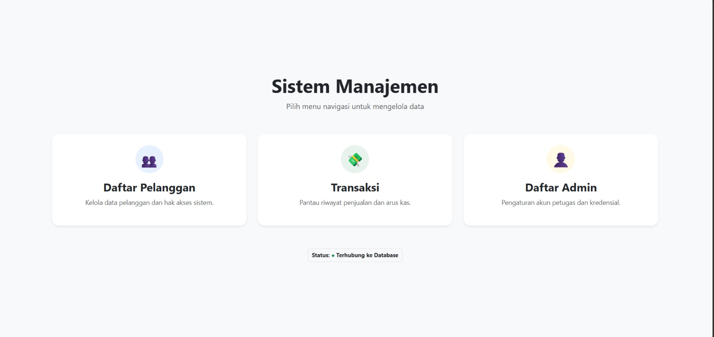
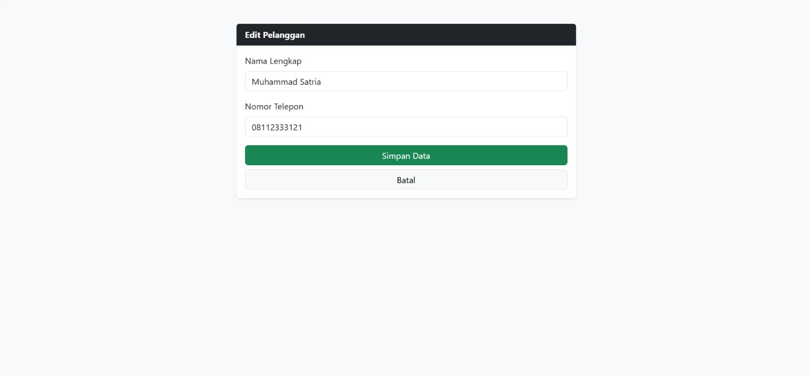
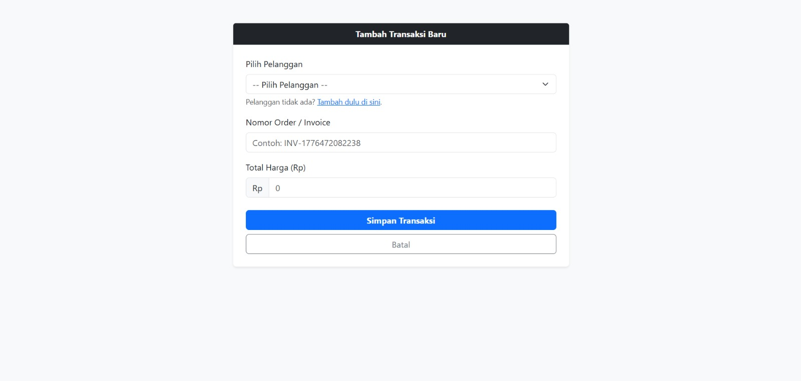
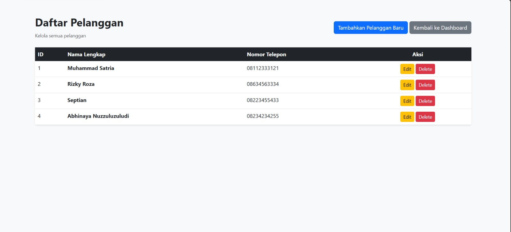
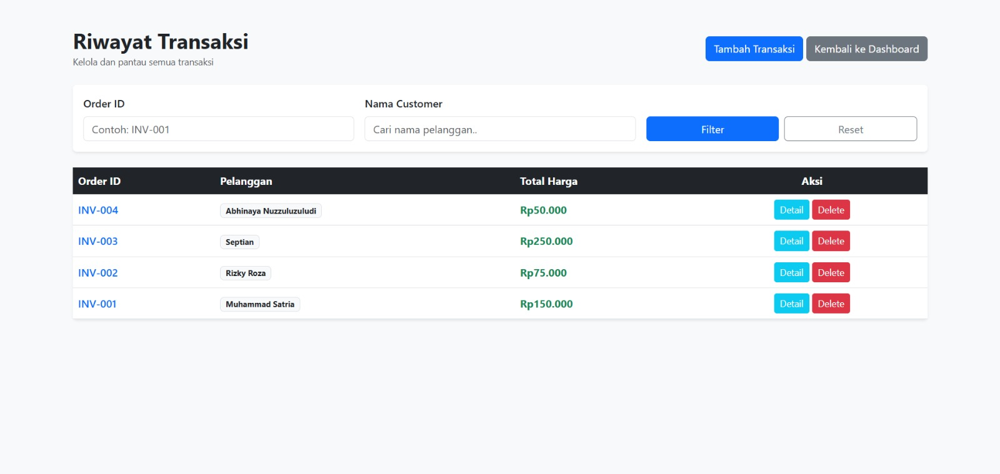

# Sistem Manajemen Transaksi

Aplikasi berbasis web menggunakan **NestJS** untuk mengelola data pelanggan dan transaksi dengan integrasi database MySQL serta server-side rendering menggunakan EJS.

---

## Project Preparation

Download Node.js dari website resmi:
https://nodejs.org/en/download

```bash
# install NestJS CLI
npm install -g @nestjs/cli

# install dependency project
npm install

# install dependency utama
npm install @nestjs/typeorm typeorm mysql2
npm install class-validator class-transformer
npm install ejs
npm install bcrypt
npm install -D @types/bcrypt
```

---
## Database Design

###  Entity Relationship Diagram (ERD)



###  Class Diagram

## Configuration

Konfigurasi database pada `app.module.ts`:

```ts
TypeOrmModule.forRoot({
  type: 'mysql',
  host: 'localhost',
  port: 3306,
  username: 'root',
  password: '',
  database: 'db_sales',
  entities: [__dirname + '/**/*.entity{.ts,.js}'],
  synchronize: true,
});
```

Konfigurasi view engine (EJS) pada `main.ts`:

```ts
app.setViewEngine('ejs');
app.setBaseViewsDir('views');
```

---

## Running Application

```bash
# menjalankan aplikasi
npm run start:dev
```

Akses aplikasi:

```
http://localhost:3000
```
## Tampilan Aplikasi

### Login Page


### Dashboard Page

---

## Example Usage

### Tambah Customer

```http
POST /customers/edit/1
```

Body:

```
name = Muhammad Satria
phone = 081123333121
```

Tampilan:




---

### Tambah Transaksi

```http
POST /transaction/add/
```

Body:

```
order_number = INV-007
total_price = 100000
customerId = 1
```

Tampilan: 

---

## Other Features

* CRUD Customer
  


* CRUD Transaksi



* Relasi Customer dengan Transaksi
* Validasi input (class-validator)

example:


keterangan : 
```
Validator dibuat dimasing" file dto, agar validasi dapat sesuai dengan object yang ada di dto tepat sebelum dimasukkan ke database.

dieksekusi dengan error exception try catch
```

* Password hashing (bcrypt)


* Server-side rendering (EJS)


---

## Project Structure

```
src/
├── customers/
├── transaction/
├── auth/
├── entities/
└── main.ts

views/
├── customers_form.ejs
├── customers_list.ejs
├── auth_form.ejs
├── transaction_list.ejs
├── transaction_form.ejs
├── dashboard.ejs
├── users_list.ejs
├── transaction_detail.ejs
├── login.ejs

```

---

## Notes

* Gunakan **Body (x-www-form-urlencoded)** saat testing di Postman
* Jangan gunakan Query Params untuk POST
* Pastikan `customerId` valid saat membuat transaksi
* Password harus di-hash menggunakan bcrypt

---

## Contributing
Pull request diperbolehkan.
---
